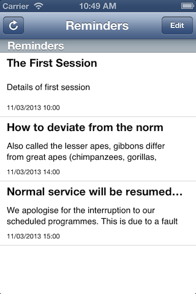

# Reminders Viewer
## View Reminders

A simple utility app for iPhone developers that allows you to view the basic details of any reminders that have been added to your Reminders store. You can also delete any reminders.

### Why would you want to use this app?

If you are developing and testing an app that adds reminders to the Reminders store then this app is handy. On an iPhone you can view reminders in the Reminders app. However, the iPhone simulator doesn't have a Reminders app and testing and viewing/deleting reminders is not possible.

With this app you can simply view and delete any reminders in the iPhone simulator when testing. It also works on an actual device.

***
[Dada Beatnik](http://www.dadabeatnik.com)
